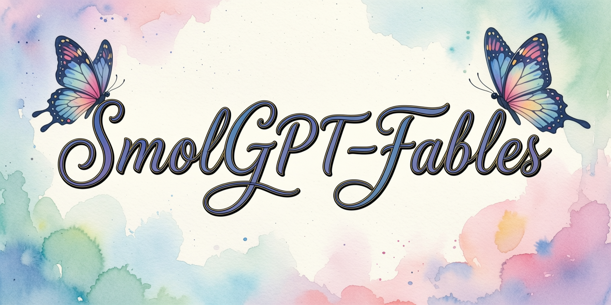
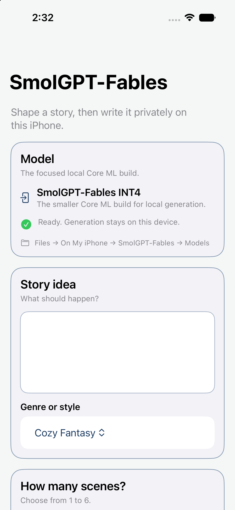
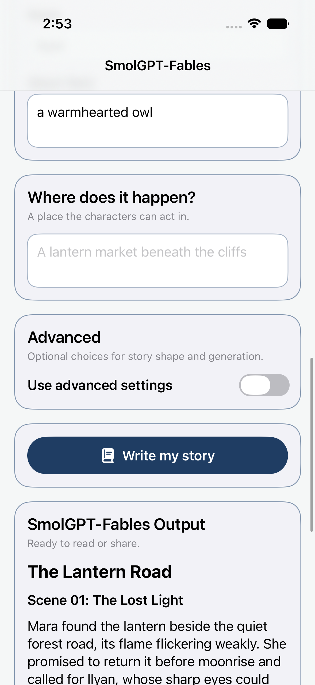
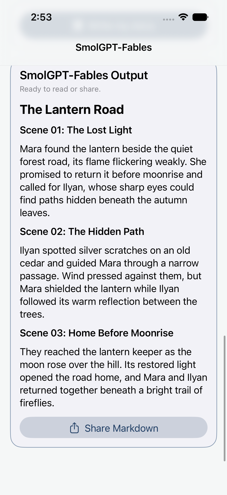

  

# SmolGPT-Fables for iPhone

Shape an idea into a fable, then let a small local model write it privately on your iPhone.

Choose a genre, decide how many scenes you want, describe your characters, and give the story a setting. SmolGPT-Fables turns that canvas into a readable Markdown story you can save or share.

## What you can make

- One- to six-scene fables
- Stories with named, consistent main characters
- Fantasy, mystery, folklore, science fiction, romance, and more
- Shareable Markdown with a title and clear scene headings
- Fully local stories after the first model download

## See it in action

The gallery follows one three-scene fable from the studio to its ending.

  
  &nbsp;
  
  &nbsp;
  

## Try it

1. Clone this repository.
2. Open `SmolGPTFables.xcodeproj` in Xcode.
3. Choose an iPhone or the iOS 27 simulator.
4. Press Run.
5. Download the model once inside the app, then write locally.

## The model

The app is powered by **SmolGPT-Fables v1**, a compact story model with a Core ML build for local generation.

**[View the SmolGPT-Fables model card on Hugging Face →](https://huggingface.co/neonforestmist/smolgpt-fables)**

## Private by design

There are no API keys and no cloud story generation. After the model is downloaded, your prompts and stories stay on your device.

## License

Apache 2.0
